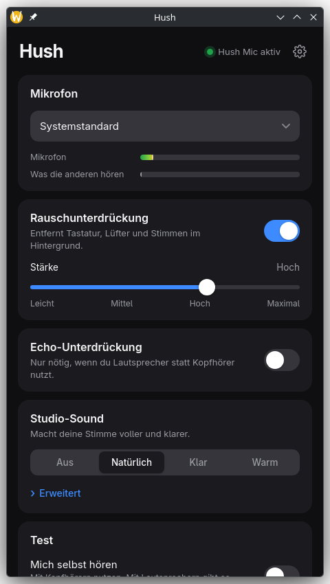

# Hush

One switch for clean microphone audio on Linux.

Hush adds a virtual microphone called **Hush Mic** that removes background noise with
[DeepFilterNet 3](https://github.com/Rikorose/DeepFilterNet) and can add a light "studio" polish on top.
Pick **Hush Mic** in Discord, Element, Teams, Zoom or OBS and you are done.

<p align="center"></p>

## Features

* **Noise suppression** with four strengths (light to maximum). Typically 25 to 30 dB of background
  noise removed, measured on a synthetic noisy recording. Costs about 8 % of one CPU core.
* **Studio sound** presets (Natural, Clear, Warm) built from low-cut, gate, EQ, de-esser, compressor and
  limiter, plus an "Advanced" view with a few sliders.
* **Echo suppression** for speaker setups (WebRTC AEC3). *Experimental*: it needs a few seconds to adapt.
* **Profile fixer**: a USB mic stuck on the `pro-audio` profile (where most tools silently do nothing) is
  detected and switched to a call-friendly profile with one click.
* **Hotplug**: unplug and replug the microphone, Hush Mic stays put and picks the mic up again.
* **Test mode**: hear yourself (use headphones), with a hold-to-hear-the-original A/B button.
  Self-monitoring switches itself off if the app goes away, it can never get stuck on.
* **Default microphone** option that restores your previous default when Hush stops, even after a crash.
* Tray icon, autostart, light and dark theme, English and German.

## Safe by design

* Hush never writes PipeWire configuration. It is a normal PipeWire client. If it crashes, only
  "Hush Mic" disappears and the rest of your audio keeps running. (Tested with `kill -9`.)
* Everything runs locally. No account, no telemetry, audio never leaves your machine.
* PipeWire only (with WirePlumber). No PulseAudio-only systems.

## Install

Arch Linux (AUR package in preparation, see `packaging/aur`):

```sh
makepkg -si -D packaging/aur
```

From source, you need `rust`, `clang`, `nodejs`, `npm`, `pipewire`, `webkit2gtk-4.1`,
`libayatana-appindicator` and `webrtc-audio-processing-2` (optional, for echo suppression):

```sh
cd ui && npm ci && npm run build && cd ..
cargo build --release                        # target/release/{hushd,hushctl,hush}
sudo install -Dm755 target/release/{hushd,hushctl,hush} /usr/local/bin/
sudo install -Dm644 dist/io.github.bxnnyg.Hush.service /usr/share/dbus-1/services/   # Exec=/usr/bin/hushd, adjust if needed
```

Without echo suppression: `cargo build --release --no-default-features`.

## Use

Start **Hush** from your application menu, or run the daemon and control it from the terminal:

```sh
hushd &                       # creates "Hush Mic"
hushctl status
hushctl noise max             # light | medium | high | max | on | off
hushctl studio clear          # off | natural | clear | warm
hushctl default on            # make Hush Mic the system default microphone
hushctl fix-profile           # switch a mic from 'pro-audio' to a voice profile
hushctl monitor on            # hear yourself, Ctrl+C to stop
hushctl devices --all
```

Settings live in `~/.config/hush/config.toml`.

## How it works

```
mic ─▶ [echo cancel] ─▶ [DeepFilterNet] ─▶ [gate · EQ · de-ess · compress · limit] ─▶ "Hush Mic"
```

`hushd` is a user service that talks to PipeWire and exposes a small D-Bus API
(`io.github.bxnnyg.Hush`). The desktop app and `hushctl` are clients of that API. The PipeWire
real-time callbacks only move samples through ring buffers; the DSP runs on its own thread, because the
neural network allocates while it runs. Details and the reasoning behind them are in
[docs/ARCHITECTURE.md](docs/ARCHITECTURE.md) and [CONTRIBUTING.md](CONTRIBUTING.md).

## Troubleshooting

* **I do not hear anything in my app.** Select *Hush Mic* as the microphone in that app.
* **"Hush is not running".** Start the app again, or run `hushd`.
* **Window is blank or crashes on Wayland.** Hush already sets `WEBKIT_DISABLE_DMABUF_RENDERER=1`
  (WebKitGTK problem on some NVIDIA setups). Open an issue with the terminal output.
* Bug reports: please attach `hushctl state` and (after checking it for private names) `pw-dump`.

## Status and limits

Early software. Echo suppression is experimental. Hush adds roughly 30 to 45 ms of delay because the
noise model looks slightly ahead; this is irrelevant for calls but audible when you monitor yourself
with the *processed* signal. The "original" button in the test card is nearly instant.

## License

Free for everyone to use, modify and share under **GPL-3.0-or-later**, with one extra requirement
(GPL section 7(b), see [NOTICE](NOTICE)): the attribution **"Hush by BxnnyG"** with a link to
<https://github.com/BxnnyG/hush> must stay visible in the app and the README of every copy or
fork you distribute. Because of the GPL, forks and derived packages that you distribute must also
publish their source code under the same license.

Third-party components keep their own licenses (DeepFilterNet MIT/Apache-2.0, WebRTC audio
processing BSD-3-Clause, Tauri MIT/Apache-2.0).

---

<sub>Hush by [BxnnyG](https://github.com/BxnnyG/hush)</sub>
